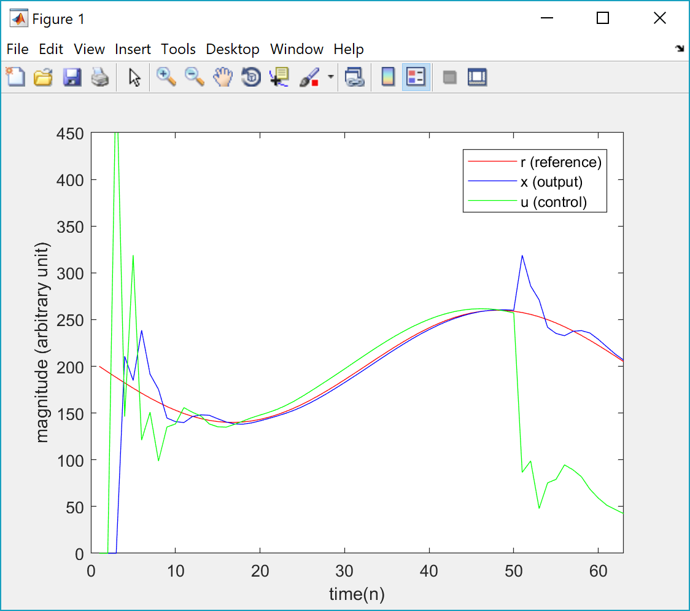
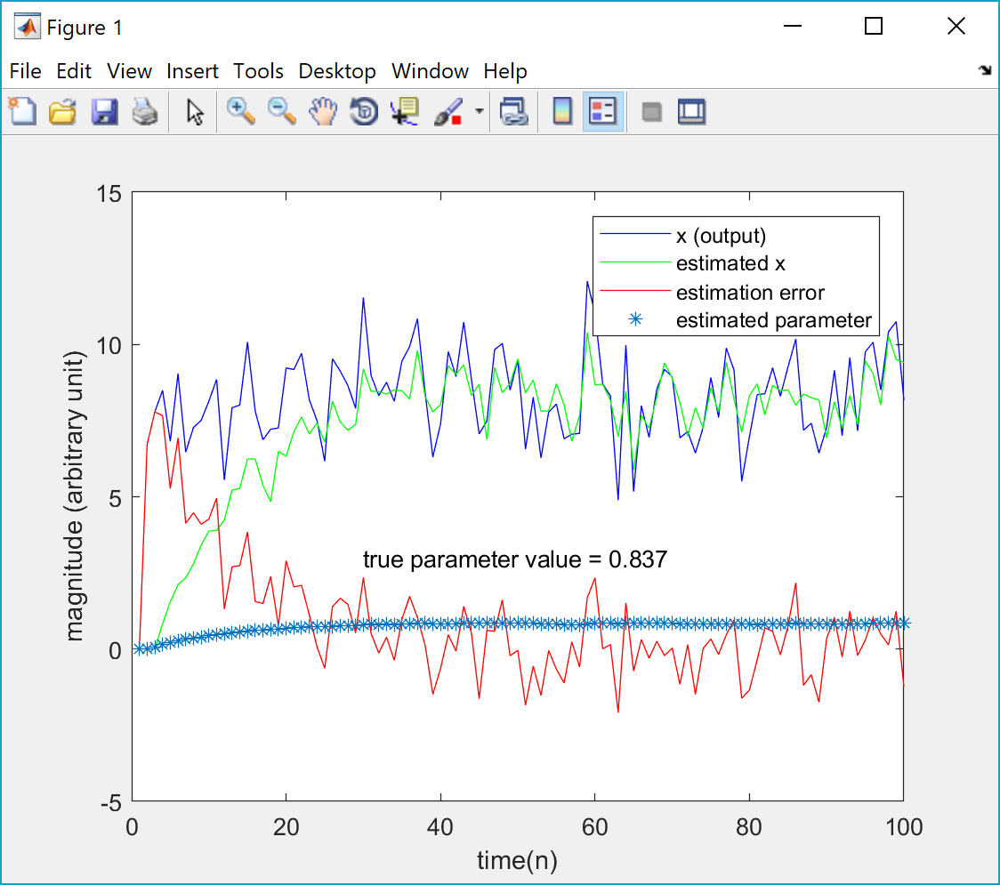

# EaaS (Engineering as a Service)
#### University of Connecticut CSMLab (Computational and Systems Medicine Lab) http://csml.uconn.edu
Microsoft Azure Service Fabric (Microservice Platform) https://azure.microsoft.com/en-us/services/service-fabric/

What is a REST API? (by MuleSoft) https://www.mulesoft.com/resources/api/what-is-rest-api-design
## PID (Proportional-Integral-Derivative) Control as a Service
#### For more information about PID control, see "Introduction to Control System Design - A First Look" by MIT (edX MOOC) 
https://www.edx.org/course/introduction-control-system-design-first-mitx-6-302-0x
### Instruction
Download and run PID_client.m (MATLAB file) on your computer where MATLAB is installed (R2014b or higher) or using MATLAB Online (https://www.mathworks.com/products/matlab-online.html). This client will remotely consume the PID control web service (REST API) priovided by the Azure Service Fabric microservices application hosted at csmlab8.uconn.edu. The result is shown below:

## LMS (Least Mean Squares) Adaptive Parameter Estimation as a Service
#### For more information about LMS adaptive filter, see "Adaptive Filters" by Prof. Ali Sayed (UCLA) 
http://iracema.icsl.ucla.edu/index.php?option=com_content&task=view&sectionid=10&id=214
### Instruction
Download and run LMS_client.m (MATLAB file) on your computer where MATLAB is installed (R2014b or higher) or using MATLAB Online (https://www.mathworks.com/products/matlab-online.html). This client will remotely consume the LMS adaptive parameter estimation web service (REST API) priovided by the Azure Service Fabric microservices application hosted at csmlab8.uconn.edu. The result is shown below:

